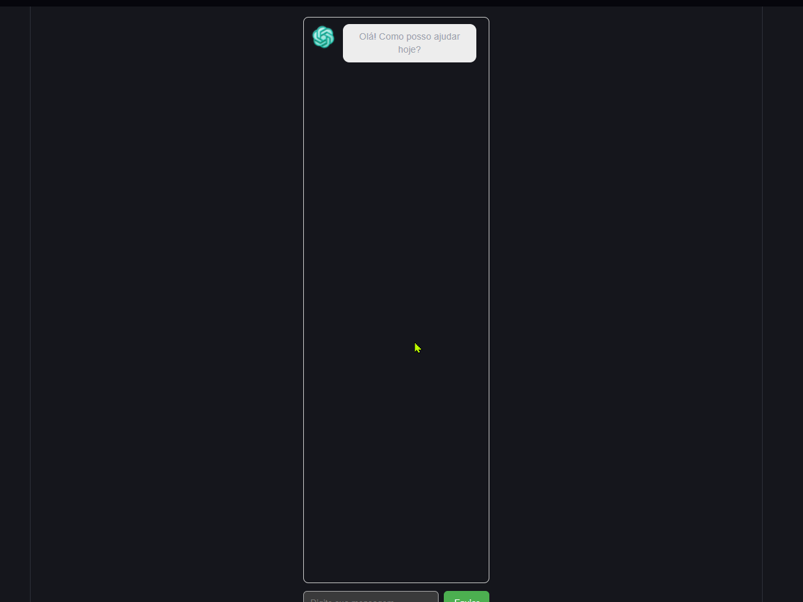
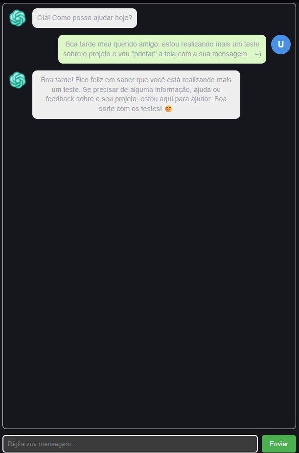

<p align="center">
<p align="center">
  
</p>
<!Título>
<h1 align="center">
  <span style="color:#00c853">ChatGPT Clone</span>
  –
  <span style="color:#ffd600">Fullstack</span>
</h1>

<!Descrição>
<p align="center">
  Projeto <span style="color:#ffd600">Fullstack</span> integrando
  <span style="color:#00c853">Node.js</span> +
  <span style="color:#2979ff">React</span> +
  <span style="color:#b388ff">OpenAI API</span> (versão moderna v1)
</p>

---

## 🚀 Demonstração

<p align="center">
  
</p>

---

## 🧰 Tecnologias Utilizadas

<div align="center">

<h2>🎯 Frontend</h2>

<table> <tr> <td>  </td> <td>  </td> </tr> <tr> <td>  </td> <td>  </td> </tr> </table>

<h2>🖥️ Backend</h2>

<table> <tr> <td>  </td> <td>  </td> </tr> <tr> <td>  </td> </tr> </table>

<h2>🛠️ Ferramentas</h2>

<table> <tr> <td>  </td> <td>  </td> </tr> </table>
</div>

---

## 📌 Sobre o Projeto

Este é um **clone simplificado do ChatGPT**, utilizando:

- Backend em **Node.js + Express**
- Frontend em **React + Vite**
- Integração com a **nova API da OpenAI (SDK v1)**

O objetivo é demonstrar como criar um chatbot funcional com uma arquitetura moderna, performática e escalável.

---

# ⚠️ Diferenças Importantes em relação ao código da DIO (obsoleto)

**O curso da DIO usa a API antiga:**

```js
const configuration = new Configuration({
  apiKey: process.env.OPENAI_API_KEY,
});

const openai = new OpenAIApi(configuration);

const response = await openai.createCompletion({...});
```

**❌ Essa API foi descontinuada pela OpenAI em 2024.**

---

**✅ Nossa versão usa a API moderna:**

```js
import OpenAI from "openai";
const client = new OpenAI({ apiKey: process.env.OPENAI_API_KEY });

const completion = await client.chat.completions.create({
  model: "gpt-3.5-turbo",
  messages: [{ role: "user", content: message }],
});
```

**📌 O que muda?**

| Recurso   | DIO (antigo)         | Nosso projeto (atual)       |
| --------- | -------------------- | --------------------------- |
| SDK usado | `openai@3`           | `openai@4`                  |
| Models    | `text-davinci-003`   | `gpt-3.5-turbo`, `gpt-4`    |
| Método    | `createCompletion()` | `chat.completions.create()` |
| Segurança | fraca                | atualizada e segura         |
| Suporte   | descontinuado        | ativo                       |

## 🏗️ Arquitetura

```
chatgpt-clone/
 ├── client/             # Frontend React + Vite
 |   ├── public
 │   |   ├── favicon.svg
 │   │   └── ia.png
 │   ├── src/
 │   │   ├── api/
 |   |   |   ├── axios.js
 |   |   |   └── chatApi.js
 │   │   ├── components/
 │   │   |   ├── Chat.jsx
 │   │   |   ├── ChatInput.jsx
 │   │   |   ├── ChatMessage.jsx
 │   │   |   └── ChatWindow.jsx
 │   │   ├── App.css
 │   │   ├── App.jsx
 │   │   ├── Index.css
 │   │   └── Main.jsx
 │   ├── index.html
 │   ├── package-lock.json
 |   ├── package.json
 │   └── vite.config.js
 │
 ├── server/             # Backend Node + Express
 │   ├── src/
 │   │   ├── controllers/chatController.js
 │   │   ├── services/openaiService.js
 │   │   ├── routes/chatRoutes.js
 |   │   └── server.js
 │   ├── .env
 │   ├── package.json
 │   └── package-lock.json
 |
 ├── assets
 |   └── images
 |       ├── cloneTest.gif
 |       ├── logo.svg
 |       └── print.png
 |
 └── README.md
```

## ⚙️ Instalação e Execução

**🔹 1. Clonar o repositório**

```Bash
git clone https://github.com/seu-usuario/chatgpt-clone.git
cd chatgpt-clone
```

**🔹 2. Backend**

```Bash
cd backend
npm install
```

Crie o arquivo:

```js
.env
```

Conteúdo do arquivo .env:

```js
OPENAI_API_KEY = sua_chave_aqui;
PORT = 5000;
```

Rodar:

```Bash
npm start
```

**🔹 3. Frontend**

```Bash
cd ../frontend
npm install
npm run dev
```

Acesse:

```js
http://localhost:5173
```

## 💬 Funcionalidades

✔ Resposta automática da IA  
✔ Scroll automático  
✔ Avatares para user e bot  
✔ Layout limpo e responsivo  
✔ Backend isolado e seguro  
✔ API moderna da OpenAI

## 📸 Preview do Chat

<p align="center">  </p>

## 🧪 Testando no Thunder Client

Cole na requisição POST:

```js
http://localhost:5000/chat
```

Body:

```json
{
  "message": "Olá IA!"
}
```

Resposta esperada:

```json
{
  "reply": "Olá! Como posso ajudar hoje?"
}
```

## 📄 Licença

Projeto criado para fins de estudo.
Você pode modificar, melhorar e reutilizar conforme desejar.

## 👤 Autor

Mark Frank

GitHub: https://github.com/omarkfrank

LinkedIn: https://www.linkedin.com/in/omarkfrank

---
